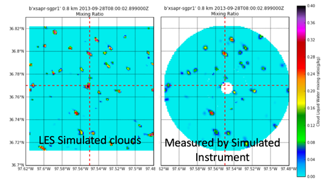
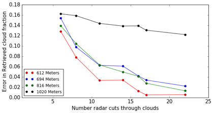

======================================================
A Rescope of the MODAL Project for Financial Year 2017
======================================================

Background
==========

Models to Observations, a Digital Atmospheric Library (MODAL) was proposed as a
strategic Laboratory Directed Research and Development (LDRD) project at the end
of FY15 to start in FY16. The original project envisaged a set of atmospheric
scenes generated through LES (with sophisticated data assimilation) with
associated observational data sets. This would then be coupled to a set of
instrument simulators which would allow virtual configurations of atmospheric
observatories. 

As MODAL was funded at just under 60 percent we focused more on quickly
modelling a pure maritime cloud field using WRF LES and a sounding from the RICO
[1] field campaign and running a simple radar simulator to investigate the
impact of sampling on retrieved cloud fraction.

   Figure 1: As example of LES Simulated clouds and radar sampled then
   re-gridded clouds. 

Figure 1 shows modelled cloud liquid water content from WRF-LES on the left and
a retrieved cloud field from a conically scanning cloud radar on the right. Many
radars map out a 3D volume in space by scanning in a nested conical fashion.
Figure 2 shows the increasing error in retrieved cloud fraction as a function of
height and also as a function of the number of nested cones. 

   Figure 2: Error in cloud fraction as a function of height in the model domain
   and number of elevation angles in a conical scanning pattern. 

This initial work has allowed us to investigate the errors in retrieved cloud
fraction due to under-sampling and is an early demonstration of the potential of
MODAL. 

During FY16 we also attempted to recruit postdoctoral talent to the team. This
became very complicated when the leading candidate turned down the offer of
employment and various runner-up candidates had already secured positions
leaving us with under qualified candidates. Fortunately we secured a highly
qualified candidate in Gökhan Sever who, after a series of visa issues, will be
joining us October 3rd. 

Re-Scope plans for Financial Year 2017
======================================

References
==========
[1] NEED RICO

