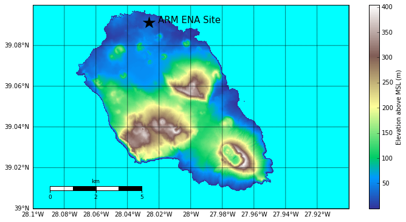
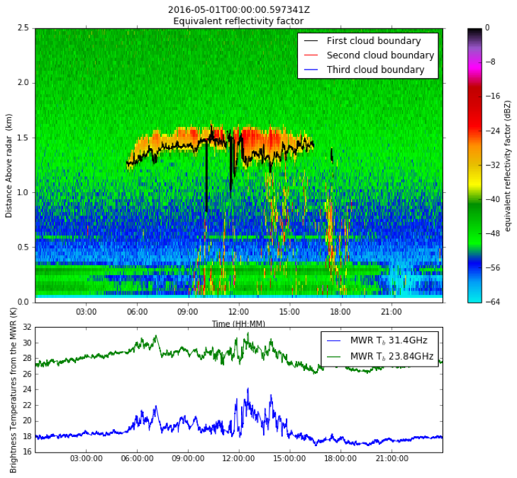

======================================================
A Rescope of the MODAL Project for Financial Year 2017
======================================================

Background
==========

Models to Observations, a Digital Atmospheric Library (MODAL) was proposed as a
strategic Laboratory Directed Research and Development (LDRD) project at the end
of FY15 to start in FY16. The original project envisaged a set of atmospheric
scenes generated through LES (with sophisticated data assimilation) with
associated observational data sets. This would then be coupled to a set of
instrument simulators which would allow virtual configurations of atmospheric
observatories. 

As MODAL was funded at just under 60 percent we focused more on quickly
modelling a pure maritime cloud field using WRF LES and a sounding from the RICO
[1] field campaign and running a simple radar simulator to investigate the
impact of sampling on retrieved cloud fraction.

.. figure:: ./cloud_radar_simulator.png
   :scale: 110 %
   :alt: Simulated clouds

   Figure 1: As example of LES Simulated clouds and radar sampled then
   re-gridded clouds. 

Figure 1 shows modelled cloud liquid water content from WRF-LES on the left and
a retrieved cloud field from a conically scanning cloud radar on the right. Many
radars map out a 3D volume in space by scanning in a nested conical fashion.
Figure 2 shows the increasing error in retrieved cloud fraction as a function of
height and also as a function of the number of nested cones. 

.. figure:: ./cloud_frac.png
   :scale: 110 %
   :alt: Simulated clouds

   Figure 2: Error in cloud fraction as a function of height in the model domain
   and number of elevation angles in a conical scanning pattern. 

This initial work has allowed us to investigate the errors in retrieved cloud
fraction due to under-sampling and is an early demonstration of the potential of
MODAL. 

During FY16 we also attempted to recruit postdoctoral talent to the team. This
became very complicated when the leading candidate turned down the offer of
employment and various runner-up candidates had already secured positions
leaving us with under qualified candidates. Fortunately we secured a highly
qualified candidate in Gökhan Sever who, after a series of visa issues, will be
joining us October 3rd. 

Re-Scope plans for Financial Year 2017
======================================
Funding for FY17 is $225K which will cover just over 25 percent of the PI
(Collis) time, fully covering Gökhan as the MODAL postdoc and a small amount of
travel to highlight results. 

Given the limited effort available a re-scope is required. In discussion with
various team members we have decided to shift the focus of MODAL away from the
Southern Great Plains to looking at the Eastern Northern Atlantic site for a number of reasons:

1) Land surface issues and limited domain size in a strongly synoptically forced environment like the SGP is very hard to model with our reduced resources.
2) There is already a DoE funded modelling exercise at the SGP.
3) There is increasing competition in studying sampling issues that is better resources and better know to DoE than us. We need to pivot to an area we can compete in.
4) The skills of Gökhan, being in flow over terrain, are better suited to the science question to be asked at the ENA. Site. 

The Eastern Northern Atlantic site
----------------------------------
ARM manages a site in the Eastern Northern Atlantic on Graciosa Island in the Azores. The terrain for the island is
shown in figure 3. The island is very small and has very steep terrain with
three distinct volcanic structures: Lower left is the Sierra Branca complex, 
upper structure is the Sierra das Fontes complex and on the lower right tip of 
the island is the Caldera volcano or "central unit" (see figure 5 of [2]). 

   Figure 3: Terrain of Graciosa Island in the Azores. Note the small size of
   the island.
 
The site was set up with the intent that it would be measuring purely oceanic
cumulus and stratocumulus which are both very important for Earth's energy
balance and are poorly understood. 

While the flow is predominantly North Westerly the question "Does the island
impact the statistics of the clouds being observed?" has yet to be answered. 

Using MODAL to Answer a Science Question
----------------------------------------
We will address this question using LES modelling and instrument simulator
capabilities built as part of the MODAL strategic initiative. 

The model will initially be set up using forcing (atmospheric state) data from the ENA with no terrain. We will determine several atmospheric states (for example: persistent north westerly flow, cold air outbreaks and tropical incursions) and perform multiple simulations (with perturbed initial conditions) and archive the output. An instrument simulator for ARM's Ka-Band Zenith pointing Radar (KaZR) as well as ARM's cloud base measuring instrument (ceilometer) will be run producing synthetic data streams which will be combined to replicate ARM's flagship Actively Remotely Sensed Cloud Layers (ARSCL) product. From the many weather states we will be able to produce a virtual cloud climatology.

   Figure 4: Examples of data (observed) that will be simulated from multiple
   runs of WRF-LES over Graciosa Island.  

Following this we will spend some development time implementing landscape into the model and re run the above simulations. This will produce two set of statics with and without the topography of Graciosa island. 

We will present this study at various DoE and other meetings and write up into a
journal publication. 

Software Engineering and Sustainable Science
--------------------------------------------
All code and results will be version controlled and hosted on a private GitHub
repository and after we have published results and the code is in a mature,
tested, state we will release open source. While the framework will not be as
sophisticated as we originally proposed it will be useful to collaborators and
able to be used as a tool by DoE for understanding how instrument parameters and
local terrain and land use impact measurements and retrievals of cloud and other
properties. 

References
==========
[1] Robert M. Rauber, Harry T. Ochs III, L. Di Girolamo, S. Göke, E. Snodgrass, Bjorn Stevens, Charles Knight, J. B. Jensen, D. H. Lenschow, R. A. Rilling, D. C. Rogers, J. L. Stith, B. A. Albrecht, P. Zuidema, A. M. Blyth, C. W. Fairall, W. A. Brewer, S. Tucker, S. G. Lasher-Trapp, O. L. Mayol-Bracero, G. Vali, B. Geerts, J. R. Anderson, B. A. Baker, R. P. Lawson, A. R. Bandy, D. C. Thornton, E. Burnet, J-L. Brenguier, L. Gomes, P. R. A. Brown, P. Chuang, W. R. Cotton, H. Gerber, B. G. Heikes, J. G. Hudson, P. Kollias, S. K. Krueger, L. Nuijens, D. W. O'Sullivan, A. P. Siebesma, and C. H. Twohy, 2007: Rain in Shallow Cumulus Over the Ocean: The RICO Campaign. Bull. Amer. Meteor. Soc., 88, 1912–1928, doi: 10.1175/BAMS-88-12-1912.

[2] Hipólito, A., Madeira, J., Carmo, R. and Gaspar, J.L. (2013) Neotectonics of 
Graciosa Island (Azores): a contribution to seismic hazard assessment of a volcanic 
area in a complex geodynamic setting.  Annals of Geophysics 56 (6), S0677.

